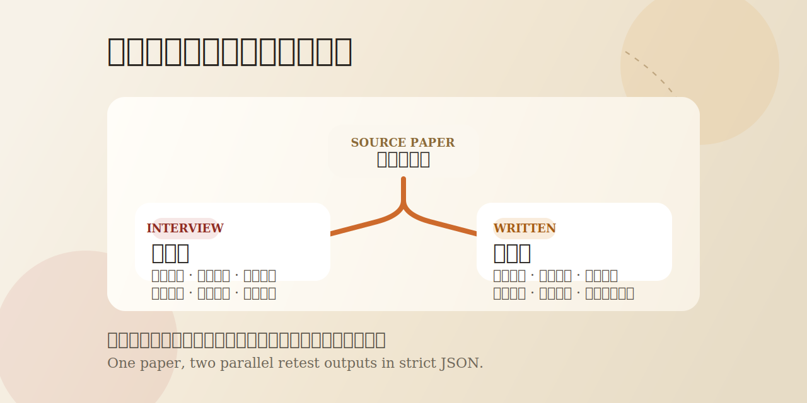
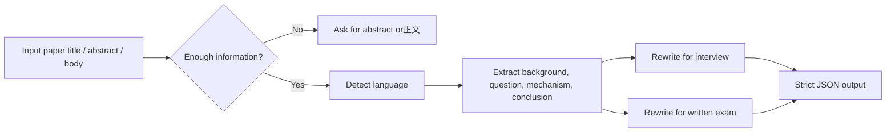

# 经济学复试文献双通道拆解器

[](./LICENSE)
[](./SKILL.md)
[](./references/output-schema.json)
[](./README.md)



> Turn one economics paper into two different retest outputs: an interview-ready version and a written-exam-ready version, both in strict JSON.

把一篇经济学文献，直接拆成两套真正适合复试的材料：

- 面试能说出口的版本
- 笔试能写上卷面的版本

这不是普通摘要器，也不是把论文换个说法复述一遍。
它的目标很明确: 帮中国高校经济学研究生复试考生，把文献阅读结果转成更接近得分场景的输出。

如果你也觉得“文献看懂了，但不会讲、不会写、不会背”是复试准备里最耗时间的一环，这个技能就是为这个问题做的。

## English Overview

This repository contains a Codex skill for Chinese economics graduate retest preparation.
Instead of generating a generic paper summary, it forces one paper into two different outputs:

- an oral, interview-ready version
- a compact, written-exam-ready version

It is designed for use cases where reading a paper is not enough and the real bottleneck is turning that reading into:

- answers you can explain out loud
- answers you can write on an exam sheet
- concepts you can memorize and reuse

## Quick Highlights

- Dual-channel split: `interview_useful` and `written_exam_useful`
- Not a generic summary tool
- Rewrites overlapping knowledge into oral and written versions separately
- Adds likely supervisor follow-up questions
- Produces strict JSON for reuse in tools, notes, or datasets

## Quick Start

Install the skill into `~/.codex/skills/`:

```bash
mkdir -p ~/.codex/skills
ln -s /path/to/economics-retest-paper-splitter ~/.codex/skills/economics-retest-paper-splitter
```

Invoke it in Codex with:

```text
$economics-retest-paper-splitter
```

Example prompt:

```text
Use $economics-retest-paper-splitter to turn this economics paper into interview-ready and written-exam-ready JSON materials.
```

## Workflow



## 为什么这个技能值得用

大多数文献总结工具只能做到这些：

- 提炼摘要
- 罗列结论
- 复述研究方法

但复试真正需要的往往是另一套能力：

- 面试时，能不能把研究问题和机制讲清楚
- 导师追问时，能不能自然展开
- 笔试时，能不能写出规范、紧凑、像标准答案的表述
- 同一个知识点，能不能区分“口头表达版”和“书面作答版”

这个技能专门解决这个错位。

## 核心卖点

- 强制双通道拆解: 同一篇文献必须拆成 `interview_useful` 和 `written_exam_useful`
- 不是普通摘要: 禁止按“摘要、引言、方法、结论”机械复述
- 自动做复试导向改写: 同一知识点会分别转成口语表达版和笔试作答版
- 对追问更友好: 输出导师可能追问和参考口头回答
- 对背诵更友好: 输出规范化结论、机制链条、高频术语和可背诵知识块
- 严格 JSON 输出: 方便继续喂给别的工具、保存到知识库或批量处理

## 适用对象

面向中国高校经济学研究生复试考生，适用方向包括：

- 宏观经济学
- 微观经济学
- 数字经济学
- 相关经济学交叉方向

同样适合这些人：

- 想把论文阅读记录结构化的人
- 想做复试知识库或题库的人
- 想批量整理文献卡片的人

## 它会做什么

输入一篇经济学文献的标题、摘要或正文后，这个技能会：

1. 先判断文献语言
2. 检查信息是否足够
3. 抽取研究背景、问题、机制、结论、政策启示、创新点和局限性
4. 强制拆成“面试有用内容”和“笔试有用内容”
5. 把重叠知识点改写成两种不同表达
6. 输出可直接复用的严格 JSON

## 和普通论文总结的区别

| 维度 | 普通总结 | 本技能 |
| --- | --- | --- |
| 输出目标 | 看懂论文 | 服务复试 |
| 输出形式 | 摘要式归纳 | 面试版 + 笔试版双通道 |
| 表达方式 | 一套说法 | 口语表达版 + 书面作答版 |
| 对追问支持 | 弱 | 包含典型追问与口头回答 |
| 对背诵支持 | 弱 | 包含术语、机制链条、可背诵知识块 |
| 可程序处理性 | 不稳定 | 严格 JSON |

## 一个典型使用场景

你读完一篇数字经济文献，知道作者大概在说什么，但一到复试就会卡在这些地方：

- 面试时不知道怎么用 1 分钟讲清研究问题
- 导师追问“机制是什么”时回答很散
- 笔试时只能写成读后感，写不出规范表述

这个技能的目标，就是把这些“知道”变成“会答”。

## 安装

将技能目录放到 `~/.codex/skills/` 下，或使用软链接安装：

```bash
mkdir -p ~/.codex/skills
ln -s /path/to/economics-retest-paper-splitter ~/.codex/skills/economics-retest-paper-splitter
```

如果你是从这个仓库直接使用，把 `/path/to/economics-retest-paper-splitter` 替换为仓库本地路径。

安装后重开一个 Codex 会话，或重启桌面应用以刷新技能列表。

## 触发方式

在对话中显式提到：

```text
$economics-retest-paper-splitter
```

例如：

```text
使用 $economics-retest-paper-splitter 拆解这篇数字经济文献，输出适合复试面试和笔试的 JSON。
```

英文也可以直接这样触发：

```text
Use $economics-retest-paper-splitter to split this economics paper into interview-ready and written-exam-ready JSON.
```

## 输入要求

优先提供以下任一内容：

- 论文标题 + 摘要
- 论文摘要 + 关键结论
- 论文正文节选
- 完整正文

如果信息不足，它不会硬编，而是先追问：

```text
请补充摘要或正文内容，以便继续拆解。
```

如果无法高置信度判断语言，它会先确认：

```text
请确认这是一篇中文文献、英文文献，还是中英混合文献？
```

## Examples

### Example Input

```text
使用 $economics-retest-paper-splitter 拆解下面这篇文献，输出适合复试面试和笔试的 JSON。

标题：数字基础设施建设与地区创新质量提升

摘要：本文基于 2011—2022 年中国地级市面板数据，考察数字基础设施建设对地区创新质量的影响。研究发现，数字基础设施显著提升地区创新质量，这一作用在东部地区和高人力资本地区更为明显。机制检验表明，数字基础设施主要通过降低信息不对称、改善金融资源配置和促进知识溢出来提升创新质量。进一步分析发现，地方政府数字治理能力越强，数字基础设施对创新质量的促进作用越明显。
```

### Example Output Snippet

```json
{
  "one_sentence_summary": "文章研究数字基础设施如何通过降低信息不对称、改善资源配置和促进知识溢出来提升地区创新质量。",
  "interview_useful": [
    {
      "label": "机制分析",
      "core_content": "这篇文章的核心机制可以概括为数字基础设施先改善信息流动和资源匹配，再通过缓解信息不对称、优化金融资源配置和促进知识溢出，最终提升地区创新质量。",
      "reason_for_interview": "机制是导师最容易继续追问的部分，能体现你是否真正理解论文而不只是记住结论。",
      "typical_questions": [
        "为什么数字基础设施会影响创新质量？",
        "作者识别出的核心机制是什么？"
      ],
      "oral_answer_sample": "我理解这篇文章的逻辑是，数字基础设施本身不是直接创造创新，而是先改善信息和资源配置效率，再通过缓解信息不对称和强化知识扩散来提高创新质量。"
    }
  ],
  "written_exam_useful": [
    {
      "label": "机制链条",
      "core_content": "数字基础设施通过降低信息不对称、改善金融资源配置和促进知识溢出三条路径提升地区创新质量。",
      "reason_for_written_exam": "适合用于简答题和论述题中的机制展开部分。",
      "question_types": [
        "简答题",
        "论述题"
      ],
      "exam_expression": "从作用机制看，数字基础设施通过降低信息不对称、改善金融资源配置并促进知识溢出，进而提升地区创新质量。"
    }
  ],
  "overlap_but_rewritten": [
    {
      "topic": "数字基础设施影响创新质量的机制",
      "interview_version": "可以把它理解为先改善信息和资源流动效率，再进一步带动创新质量上升。",
      "written_version": "数字基础设施主要通过缓解信息不对称、优化资源配置和强化知识溢出提升创新质量。"
    }
  ]
}
```

## 输出结构

输出为严格 JSON，核心字段包括：

- `paper_info`
- `language_detect_result`
- `one_sentence_summary`
- `interview_useful`
- `written_exam_useful`
- `overlap_but_rewritten`
- `low_priority`
- `review_outline`
- `extra`
- `english_support`

完整结构见 [references/output-schema.json](references/output-schema.json)。

## 输出示意

```json
{
  "one_sentence_summary": "文章研究数字基础设施如何通过降低交易成本和缓解信息不对称促进地区创新。",
  "interview_useful": [
    {
      "label": "机制分析",
      "core_content": "这篇文章的核心机制可以概括为数字基础设施改善信息流通效率，降低企业搜寻和匹配成本，从而提高创新资源配置效率。",
      "reason_for_interview": "这是导师最可能追问的部分，决定你是不是只背了结论。",
      "typical_questions": [
        "作者认为作用机制是什么？",
        "为什么数字基础设施会影响创新？"
      ],
      "oral_answer_sample": "我理解作者的核心逻辑是，数字基础设施先改善信息传递和资源匹配，再通过降低交易成本和缓解信息不对称，最终提升创新效率。"
    }
  ],
  "written_exam_useful": [
    {
      "label": "机制链条",
      "core_content": "数字基础设施通过降低交易成本、缓解信息不对称和优化资源配置三条路径促进创新。",
      "reason_for_written_exam": "适合简答题和论述题中的机制展开。",
      "question_types": [
        "简答题",
        "论述题"
      ],
      "exam_expression": "从理论机制看，数字基础设施通过降低交易成本、缓解信息不对称并优化创新资源配置，进而提升地区创新水平。"
    }
  ]
}
```

## 适合开源协作的点

- 规则明确，容易继续扩展
- 输出 schema 固定，适合接入脚本或知识库
- 既可单篇使用，也适合批量整理文献
- 可以继续扩展到更多学科复试场景

如果你觉得这个技能有用，欢迎点一个 Star。这个仓库想解决的是一个很具体但很常见的问题：把“读过文献”变成“能在复试里稳定输出”。

## 仓库结构

```text
.
├── SKILL.md
├── README.md
├── LICENSE
├── agents/
│   └── openai.yaml
└── references/
    └── output-schema.json
```

## License

MIT. See [LICENSE](LICENSE).
